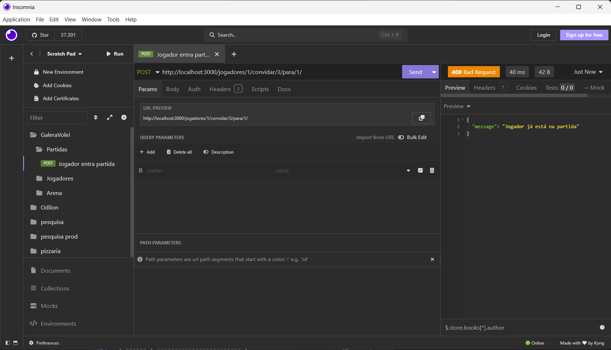
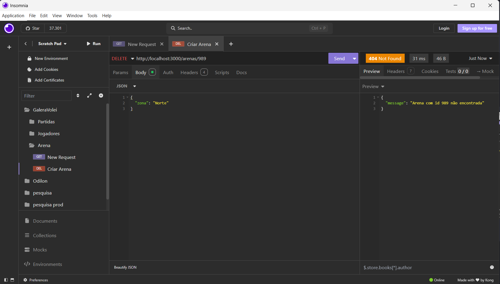

# 📘 Documentação - API Galera do Vôlei

## 📘 Funcionalidades por Entidade

### 🧍 Jogador

| Funcionalidade            | Descrição                                                                | Status              |
| ------------------------- | ------------------------------------------------------------------------ | ------------------- |
| Criar jogador             | Criação de um jogador com nome, email, idade e sexo                      | ✅ Permitido        |
| Listar jogadores          | Listagem de todos os jogadores com filtros por nome, email, sexo, idade  | ✅ Permitido        |
| Buscar jogador por ID     | Busca dos dados de um jogador específico                                 | ✅ Permitido        |
| Atualizar jogador         | Atualização de dados do jogador (nome, email, idade, sexo)               | ✅ Permitido        |
| Deletar jogador           | Exclusão de jogador do sistema                                           | ✅ Permitido        |
| Entrar em partida         | Permitir que o jogador entre em uma partida existente                    | ✅ Permitido        |
| Convidar para partida     | Permitir que um jogador convide outro para uma partida                   | ✅ Permitido        |
| Confirmar presença        | Jogador confirma (ou não) presença antes da data da partida              | 🔜 Não implementado |
| Cancelar participação     | Jogador pode cancelar sua presença com antecedência                      | 🔜 Não implementado |
| Ver estatísticas pessoais | Total de partidas jogadas, vitórias, derrotas, média de pontos, presença | 🔜 Não implementado |

---

### 🏟️ Arena

| Funcionalidade      | Descrição                                                               | Status              |
| ------------------- | ----------------------------------------------------------------------- | ------------------- |
| Criar arena         | Criação de arena com nome e zona                                        | ✅ Permitido        |
| Listar arenas       | Listagem de arenas com filtros por nome, zona, endereço, geolocalização | ✅ Permitido        |
| Buscar arena por ID | Busca de dados específicos de uma arena pelo seu ID                     | ✅ Permitido        |
| Atualizar arena     | Atualização de dados da arena (nome, zona, endereço, geolocalização)    | ✅ Permitido        |
| Deletar arena       | Exclusão de uma arena do sistema                                        | ✅ Permitido        |
| Ver disponibilidade | Consultar datas/horários disponíveis para agendar uma partida           | 🔜 Não implementado |
| Reservar arena      | Permitir reservar uma arena para data/hora específica                   | 🔜 Não implementado |
| Cancelar reserva    | Cancelar uma reserva existente, liberando o espaço                      | 🔜 Não implementado |
| Avaliar arena       | Jogadores podem avaliar a arena (estrutura, iluminação, etc.)           | 🔜 Não implementado |
| Ver agenda da arena | Mostrar todas as partidas agendadas para uma arena                      | 🔜 Não implementado |

---

### 🏆 Partida

| Funcionalidade                | Descrição                                                                                 | Status              |
| ----------------------------- | ----------------------------------------------------------------------------------------- | ------------------- |
| Criar partida                 | Criação de uma partida com nome, data, arena, jogadores, número máximo de jogadores, tipo | ✅ Permitido        |
| Listar partidas               | Listagem de partidas com filtros por nome, data, arena, admin, tipo, número de jogadores  | ✅ Permitido        |
| Buscar partida por ID         | Busca dos dados de uma partida específica                                                 | ✅ Permitido        |
| Atualizar partida             | Atualização de dados da partida (nome, data, jogadores, arena)                            | ✅ Permitido        |
| Deletar partida               | Exclusão de partida do sistema                                                            | ✅ Permitido        |
| Iniciar partida               | Marcar uma partida como iniciada                                                          | ✅ Permitido        |
| Finalizar partida             | Marcar uma partida como concluída e registrar o resultado final                           | 🔜 Não implementado |
| Registrar placar              | Permitir registrar o placar set a set após a finalização da partida                       | 🔜 Não implementado |
| Cancelar partida              | Cancelar uma partida futura com motivo e notificar os jogadores                           | 🔜 Não implementado |
| Dividir times automaticamente | Gerar divisão automática dos jogadores em dois times equilibrados                         | 🔜 Não implementado |
| Dividir times manualmente     | Jogadores escolhem em qual time jogar manualmente                                         | ✅ Permitido        |
| Lista de espera               | Jogadores extras entram em uma fila de espera para substituir ausentes                    | 🔜 Não implementado |

# Entidades

## 🧍 Jogadores

Entidade que representa um usuário/jogador cadastrado no sistema.

### Atributos:

| Campo   | Tipo                    | Obrigatório | Descrição                |
| ------- | ----------------------- | ----------- | ------------------------ |
| `id`    | `string`                | Sim         | Identificador único      |
| `nome`  | `string`                | Sim         | Nome completo do jogador |
| `email` | `string`                | Sim         | E-mail                   |
| `idade` | `number`                | Sim         | Idade                    |
| `sexo`  | `"M"`, `"F"`, `"Outro"` | Sim         | Gênero do jogador        |

---

## Endpoints

### ✅ `GET /jogadores`

- Lista todos os jogadores cadastrados.

📦 **Response:** `200 OK`

```json
[
  {
    "id": "1",
    "nome": "João",
    "email": "joao@example.com",
    "idade": 25,
    "sexo": "M"
  }
]
```


---

### ✅ `GET /jogadores/:id`

- Busca os dados de um jogador pelo seu ID.

📦 **Response:** `200 OK`

```json
{
  "id": "1",
  "nome": "João",
  "email": "joao@example.com",
  "idade": 25,
  "sexo": "M"
}
```


🔴 **Erro:** `404 Not Found`

```json
{
  "message": "Jogador com id 99 não encontrado"
}
```


---

### ➕ `POST /jogadores`

- Cadastra um novo jogador.

📥 **Request Body:**

```json
{
  "nome": "Maria",
  "email": "maria@example.com",
  "idade": 22,
  "sexo": "F"
}
```


📦 **Response:** `201 Created`

```json
{
  "id": "2",
  "nome": "Maria",
  "email": "maria@example.com",
  "idade": 22,
  "sexo": "F"
}
```

🔴 **Erro:** `400 Bad Request`

```json
{
  "message": "Dados inválidos para criar um jogador"
}
```


---

### ✏️ `PUT /jogadores/:id`

- Atualiza os dados de um jogador.

📥 **Request Body:**

```json
{
  "nome": "João Silva",
  "email": "joao.silva@example.com",
  "idade": 26,
  "sexo": "M"
}
```


📦 **Response:** `200 OK`

```json
{
  "id": "1",
  "nome": "João Silva",
  "email": "joao.silva@example.com",
  "idade": 26,
  "sexo": "M"
}
```

🔴 **Erro:** `404 Not Found`

---

### ❌ `DELETE /jogadores/:id`

- Remove um jogador do sistema.

📦 **Response:** `204 No Content`


🔴 **Erro:** `404 Not Found`


---

## 🎮 Participação em Partidas

### `POST /jogadores/:jogadorId/partidas/:partidaId`

- Um jogador entra em uma partida existente.

📦 **Response:** `200 OK`

```json
{
  "id": "1",
  "nome": "Partida 1",
  "adminId": "1",
  "data_partida": "2025-10-12T19:15:36.540Z",
  "arenaId": "1",
  "jogadoresIds": ["1", "3", "2"],
  "status": "agendada",
  "tipo": "publica"
}
```


🔴 **Erro:** `404 Not Found`  

🔴 **Erro:** `400 Bad Request` (limite de jogadores)
🔴 **Erro:** `401 Unauthorized` (partida privada)


---

### `POST /jogadores/:jogadorAnfitriaoId/convidar/:jogadorConvidadoId/para/:partidaId`

- O jogador anfitrião convida outro jogador para uma partida.

📦 **Response:** `200 OK`

```json
{
{
	"id": "3",
	"nome": "Partida 3",
	"adminId": "1",
	"data_partida": "2025-10-12T19:48:47.441Z",
	"arenaId": "3",
	"jogadoresIds": [
		"5",
		"1",
		"2"
	],
	"status": "agendada",
	"tipo": "privada",
	"updatedAt": "2025-10-12T19:49:01.358Z"
}
}
```


🔴 **Erros possíveis:**

- `404 Not Found`

  - Partida, anfitrião ou convidado não encontrado
    
    
    

- `401 Unauthorized`

  - Jogador não é administrador da partida


- `400 Bad Request`

  - Jogador já está na partida

  

---

## ⚠️ Possíveis Erros

| Código | Descrição                |
| ------ | ------------------------ |
| 400    | Dados inválidos enviados |
| 401    | Ação não autorizada      |
| 404    | Recurso não encontrado   |
| 500    | Erro interno do servidor |

---

## 🏟️ Arenas

A entidade **Arena** representa um local físico onde partidas de vôlei podem acontecer. Cada arena possui:

- `id` (string)
- `nome` (string)
- `zona` (string) — por exemplo: Norte, Sul, Leste, Oeste
- `endereco` (string, opcional)
- `geolocalizacao` (string, opcional)

---

### 📍 `GET` `/api/arenas`

Retorna todas as arenas cadastradas. Aceita filtro por `zona`.

#### Query Params (opcional):

- `zona`: filtra arenas por zona.

#### Exemplo de requisição:

```http
GET /api/arenas
GET /api/arenas?zona=Sul
```

#### Response: `200 OK`

```json
[
  {
    "id": "1",
    "nome": "Arena Central",
    "zona": "Sul",
    "endereco": "Rua A, 123",
    "geolocalizacao": "-23.55052,-46.633308"
  }
]
```


---

### 🔍 `GET` `/api/arenas/{id}`

Retorna os dados de uma arena específica.

#### Exemplo:

```http
GET /api/arenas/1
```

#### Response: `200 OK`

```json
{
  "id": "1",
  "nome": "Arena Central",
  "zona": "Sul",
  "endereco": "Rua A, 123",
  "geolocalizacao": "-23.55052,-46.633308"
}
```


#### Erros possíveis:

- `404 Not Found`: Arena com ID não encontrada.


---

### ➕ `POST` `/api/arenas`

Cria uma nova arena.

#### Body:

```json
{
  "nome": "Arena da Zona Norte",
  "zona": "Norte"
}
```


#### Response: `201 Created`

```json
{
  "id": "2",
  "nome": "Arena da Zona Norte",
  "zona": "Norte"
}
```

#### Erros possíveis:

- `400 Bad Request`: Dados inválidos.


---

### 📝 `PUT` `/api/arenas/{id}`

Atualiza os dados de uma arena existente.

#### Body:

```json
{
  "nome": "Arena Atualizada",
  "zona": "Oeste",
  "endereco": "Av. Nova, 456",
  "geolocalizacao": "-23.56789,-46.6789"
}
```


#### Response: `200 OK`

```json
{
  "id": "2",
  "nome": "Arena Atualizada",
  "zona": "Oeste",
  "endereco": "Av. Nova, 456",
  "geolocalizacao": "-23.56789,-46.6789"
}
```

#### Erros possíveis:

- `404 Not Found`: Arena com ID não encontrada.
  
- `400 Bad Request`: Dados inválidos.

---

### ❌ `DELETE` `/api/arenas/{id}`

Remove uma arena do sistema.

#### Exemplo:

```http
DELETE /api/arenas/2
```

#### Response: `204 No Content`


#### Erros possíveis:

- `404 Not Found`: Arena com ID não encontrada.



---

## 🏐 Partidas

A entidade **Partida** representa um jogo de vôlei agendado. Cada partida possui:

- `id` (string)
- `nome` (string)
- `data_partida` (Date)
- `arenaId` (string)
- `adminId` (string)
- `jogadoresIds` (string[])
- `num_max_jogadores` (number, opcional)
- `status`: `"agendada"` | `"em_andamento"` | `"finalizada"`
- `tipo`: `"publica"` | `"privada"`

---

### 🔄 `GET` `/api/partidas`

Retorna todas as partidas cadastradas.

#### Exemplo:

```http
GET /api/partidas
```

#### Response: `200 OK`

```json
[
  {
    "id": "1",
    "nome": "Partida das 19h",
    "data_partida": "2025-10-14T19:00:00.000Z",
    "arenaId": "1",
    "adminId": "1",
    "jogadoresIds": ["1", "2"],
    "status": "agendada",
    "tipo": "publica"
  }
]
```


---

### 🔍 `GET` `/api/partidas/{id}`

Retorna os dados de uma partida específica.

#### Exemplo:

```http
GET /api/partidas/1
```

#### Response: `200 OK`

```json
{
  "id": "1",
  "nome": "Partida das 19h",
  "data_partida": "2025-10-14T19:00:00.000Z",
  "arenaId": "1",
  "adminId": "1",
  "jogadoresIds": ["1", "2"],
  "status": "agendada",
  "tipo": "publica"
}
```


#### Erros possíveis:

- `404 Not Found`: Partida com ID não encontrada.


---

### ➕ `POST` `/api/partidas`

Cria uma nova partida.

#### Body:

```json
{
  "nome": "Partida das 20h",
  "data_partida": "2025-10-15T20:00:00.000Z",
  "arenaId": "2",
  "adminId": "1",
  "jogadoresIds": ["1"],
  "num_max_jogadores": 10,
  "tipo": "privada"
}
```

#### Response: `201 Created`

```json
{
  "id": "2",
  "nome": "Partida das 20h",
  "data_partida": "2025-10-15T20:00:00.000Z",
  "arenaId": "2",
  "adminId": "1",
  "jogadoresIds": ["1"],
  "num_max_jogadores": 10,
  "status": "agendada",
  "tipo": "privada"
}
```


#### Erros possíveis:

- `400 Bad Request`: Dados inválidos.


---

### 📝 `PUT` `/api/partidas/{id}`

Atualiza os dados de uma partida existente.

#### Body:

```json
{
  "nome": "Partida das 21h",
  "data_partida": "2025-10-15T21:00:00.000Z",
  "arenaId": "2",
  "jogadoresIds": ["1", "2", "3"]
}
```

#### Response: `200 OK`

```json
{
  "id": "2",
  "nome": "Partida das 21h",
  "data_partida": "2025-10-15T21:00:00.000Z",
  "arenaId": "2",
  "adminId": "1",
  "jogadoresIds": ["1", "2", "3"],
  "status": "agendada",
  "tipo": "privada"
}
```

#### Erros possíveis:

- `404 Not Found`: Partida com ID não encontrada.

---

### ❌ `DELETE` `/api/partidas/{id}`

Remove uma partida do sistema.

#### Exemplo:

```http
DELETE /api/partidas/2
```

#### Response: `204 No Content`

#### Erros possíveis:

- `404 Not Found`: Partida com ID não encontrada.

---

### ▶️ `PATCH` `/api/partidas/{id}/iniciar`

Inicia uma partida, alterando seu status para `"em_andamento"`.

#### Exemplo:

```http
PATCH /api/partidas/1/iniciar
```

#### Response: `200 OK`

```json
{
  "id": "1",
  "status": "em_andamento",
  ...
}
```

#### Erros possíveis:

- `404 Not Found`: Partida não encontrada
- `401 Unauthorized`: Usuário não autorizado a iniciar
- `400 Bad Request`: Partida já iniciada ou finalizada

---
